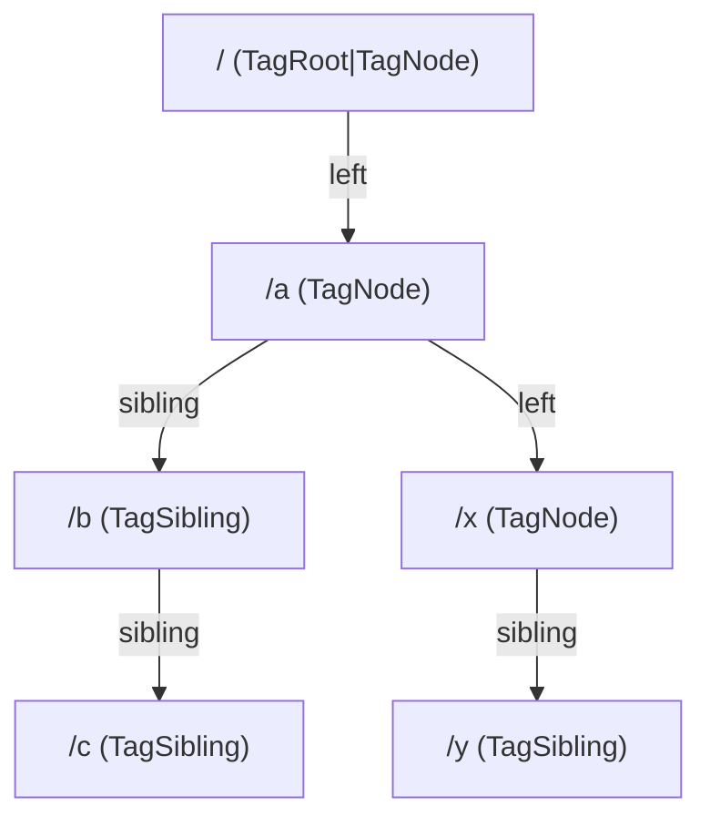
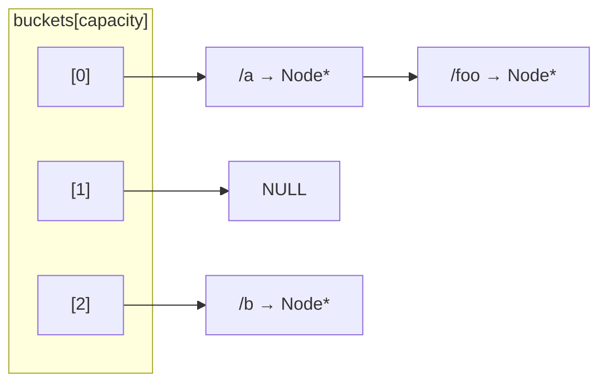

# Memora

-blue)


A small TCP database server written in C. Clients log in over a raw socket, create or select a
**database**, and shape a **path tree** (think directories) whose nodes can
eventually hold key/value **leaves**.

- **One process per client** — `fork()`'d off the accept loop, so a crash in
  one connection's handler can't take down another.
- **Left-child/right-sibling tree** — an arbitrary-arity tree encoded with
  just two pointers per node (`left`, `sibling`).
- **Hand-rolled hash table** — separate chaining, `path → Node*`, so lookups
  don't require walking the tree.
- **Ownership-scoped persistence** — every database is a flat file under
  `database/`, replayed line-by-line on `use-database`.

## Table of contents

- [Getting started](#getting-started)
- [Command reference](#command-reference)
- [Data structures](#data-structures)
- [Project layout](#project-layout)
- [Known limitations](#known-limitations)

## Getting started

```sh
make            # builds build/memora
./build/memora  # starts the server on 127.0.0.1:8008 (or ./build/memora <port>)
```

On first run (no `database/users.db` yet), the server prompts on its own
stdin/stdout to create the initial admin user before it starts accepting
connections.

Talk to it with any TCP client, e.g. `nc`:

```sh
$ nc 127.0.0.1 8008
OK: Connected to Memora.
login admin hunter2
OK: Logged in successfully.
create-database mydb
OK: Ownership added successfully.
OK: Database created successfully.
use-database mydb
OK: Database loaded successfully!
OK: Using database 'mydb'.
create-node /users
OK: Added child node.
tree
OK: Printing tree.
child: /users
```

Every response follows the same convention: `OK: <message>` on success,
`ERR: <message>` on failure. Commands that return data (`tree`, `hash-table`,
`list-databases`, `ping`) print the payload as plain lines with no prefix.

## Command reference

Registered in `handlers[]` ([memora.c](src/memora.c)):

| Command | Args | Login required | Description |
|---|---|---|---|
| `ping` | 0 | no | Health check → `pong` |
| `login` | `<username> <password>` | no | Authenticate the connection |
| `logout` | 0 | yes | End the session |
| `create-database` | `<name>` | yes | Create a new database, owned by the caller |
| `use-database` | `<name>` | yes | Load a database's tree + hash table |
| `list-databases` | 0 | yes | List databases owned by the caller |
| `create-node` | `<path>` | yes | Add a path node under the active database |
| `remove-node` | `<path>` | yes | Remove a path node (and its subtree) |
| `search-node` | `<path>` | yes | Check whether a path exists |
| `tree` | 0 | yes | Print the active database's tree |
| `hash-table` | 0 | yes | Dump the active database's hash table buckets |

`delete-database` and `rename-database` exist in [database.c](src/database.c)
but aren't yet registered as commands. Key/value `set`/`get` handlers for
`Leaf` entries aren't implemented yet either.

## Data structures

### The path tree (left-child / right-sibling)

Each path segment is a `Node`. A `Node` points at its **first child**
(`left`) and its **next sibling** (`sibling`) — a classic LCRS encoding of
an arbitrary-arity tree using only two pointers per node. A `Leaf` (not yet
wired to any command handler) hangs off a `Node`'s `leaves` list to store
an actual key/value pair.



Reading this diagram: `/a`, `/b`, `/c` are siblings (children of root);
`/a` additionally has its own children `/x`, `/y`. The `tag` byte on each
node (`TagNode` vs `TagSibling`) records whether that node reached its
parent via the `left` link or the `sibling` link — `remove_node` needs
this to know which parent pointer to relink.

### The hash table

Separate chaining, `strdup`'d path string → `Node*` (stored as `int8*`).
Used so `add_node`/`remove_node` don't have to walk the tree to find a
parent by path.



No resize logic exists yet — `LOAD_FACTOR_THRESHOLD` is defined but
unused, so long-lived tables with many entries degrade to long chains.

## Project layout

```
c-database-design/
├── include/           # Public headers, one per module
│   ├── database.h
│   ├── hash_table.h
│   ├── memora.h        # Client struct, CmdHandler, server entry points
│   ├── tree.h
│   ├── users.h
│   └── utils.h
├── src/                # One .c per header, same names
├── database/           # Runtime data: users.db, owners.db, <name>.db per db
├── build/              # Makefile output (objects + the memora binary)
└── Makefile
```

## Known limitations

- No key/value `set`/`get` commands yet — the tree can be shaped but not
  used to store data (`Leaf.key`/`value`/`size` are unused).
- Hash table never resizes (`LOAD_FACTOR_THRESHOLD` is defined, unused).
- `delete-database` / `rename-database` aren't wired into `handlers[]`.
- Passwords are compared in plaintext (`password_hash` is a field name,
  not an actual hash) and admin creation happens over the server's own
  stdin, not over the wire.
- One process per connection, no locking — concurrent clients touching
  the same database file can race.
